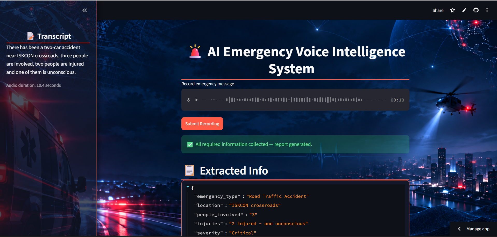
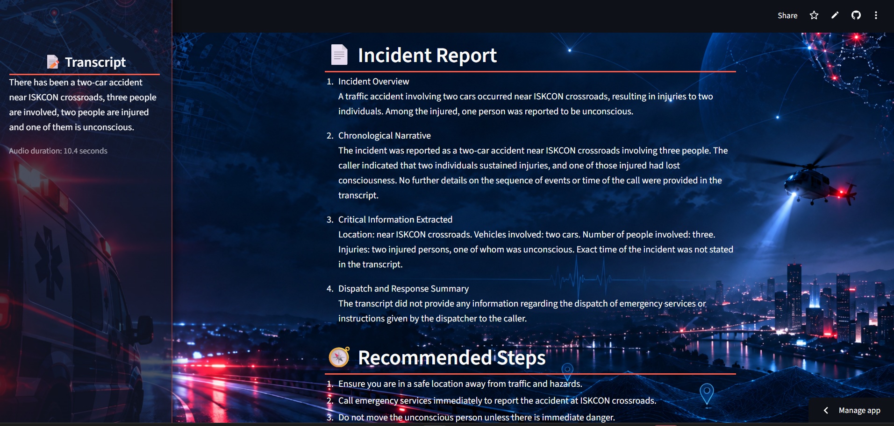
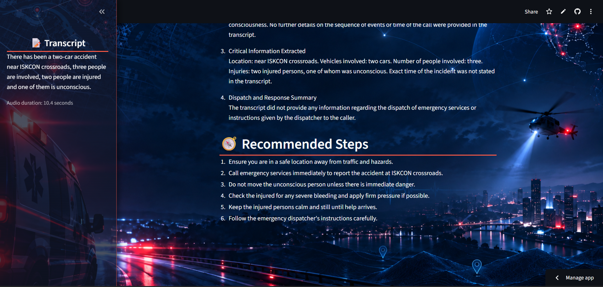

# 🚨 AI Emergency Voice Intelligence System

A voice-in, text-out emergency call assistant. A caller speaks, the system
transcribes and extracts structured incident data, asks follow-up questions
for missing factual information, automatically assesses incident severity,
and — once all required factual fields are known — produces a formal incident
report and a short set of pre-arrival safety steps.

## 🎥 Demo

🔗 **Live Demo:** [Try the Emergency Voice Intelligence System](https://emergency-voice-intelligence-system.streamlit.app/)

## 📸 Screenshots

### Emergency Information Collection


### Structured Incident State


### Incident Report & Pre-arrival Recommendations


## 🏗️ Architecture

```text
Streamlit UI (st.audio_input, mic recording)
       |
   Audio bytes (WAV) -> duration calculated
       |
OpenAI Whisper (whisper-1, audio.translations endpoint)
       |
   Transcript text
       |
GPT-4.1 mini factual structured extraction (OpenAI Responses API)
       |
State merge (new values update known incident facts; previous values carry forward)
       |
Missing-field check -----> Follow-up question(s) shown to caller
       |                          |
       |                    (loop until all 4 required factual fields are known)
       v
GPT-4.1 mini severity assessment
(from complete accumulated structured incident state)
       |
AI-assessed severity: Low / Medium / High / Critical / Unknown
       |
GPT-4.1 mini Incident Report (from full transcript)
       +
GPT-4.1 mini Pre-arrival Recommendation (from structured state)
       |
Streamlit display (sidebar transcript, JSON state, report, recommendations)
```

Core processing stages are wrapped in `@traceable` (LangSmith) for tracing
and observability.

## 📁 Files and which stage they handle

| File | Stage |
| --- | --- |
| `input_fetch_convert.py` | Mic capture (`st.audio_input`) + Whisper speech-to-text |
| `extract_info.py` | GPT-4.1 mini factual field extraction + AI severity assessment |
| `check_info_followup.py` | State merge, missing-field detection, follow-up question generation |
| `generate_report_recommendation.py` | Incident report generation + pre-arrival safety recommendations |
| `app.py` | Streamlit app — session state, UI, and pipeline orchestration |

## 📋 Structured incident fields

The application maintains the following incident state:

`emergency_type`, `location`, `people_involved`, `injuries`, `severity`

The first four fields are factual fields collected from the caller:

- `emergency_type`
- `location`
- `people_involved`
- `injuries`

These default to `"Unknown"` until enough information is available to extract
them with sufficient confidence.

The `injuries` field can contain only an injury count when that is all the
caller provides (for example, `"2 injured"`). Additional details such as
unconsciousness, breathing status, heavy bleeding, entrapment, or seriousness
are captured when mentioned, but they are not required for the field to be
considered known.

`severity` is not requested from the caller. It is automatically derived by
GPT-4.1 mini from the accumulated structured incident information and is
classified as:

`Low`, `Medium`, `High`, `Critical`, or `Unknown`

The assessment considers available facts such as emergency type, number of
people involved, injuries, injury condition when available, and ongoing
hazards. Critical severity requires concrete life-threatening indicators such
as not breathing, unconsciousness/unresponsiveness, severe bleeding, or
entrapment in an active hazardous situation.

Safety-sensitive fields such as location are handled conservatively and are
not guessed when unclear.

## ⚙️ Setup

1. Create a virtual environment (recommended):

   ```bash
   python -m venv venv
   venv\Scripts\activate      # Windows
   source venv/bin/activate   # Mac/Linux
   ```

2. Install dependencies:

   ```bash
   pip install -r requirements.txt
   ```

3. Add a `.env` file with:

   ```env
   OPENAI_API_KEY=your_key_here
   ```

   The key is loaded using `python-dotenv` when the application starts.

   For LangSmith tracing, also configure the standard LangSmith environment
   variables:

   ```env
   LANGSMITH_API_KEY=your_key_here
   LANGSMITH_TRACING=true
   LANGSMITH_PROJECT=your_project_name
   ```

   LangSmith tracing is optional; the application can run without it.

4. Make sure `assets/emergency_bg.png` exists relative to `app.py`.

5. Run the application:

   ```bash
   streamlit run app.py
   ```

## 🗣️ How it works, in plain words

1. **Speak** — the caller records an emergency message through the browser microphone.

2. **Transcribe** — Whisper converts the recording into text. The current
   implementation is turn-based (`record → submit → transcribe`) rather than
   continuous audio streaming.

3. **Extract** — GPT-4.1 mini processes the latest caller turn and extracts
   whichever factual incident fields can be determined with sufficient
   confidence: emergency type, location, people involved, and injuries.

4. **Merge & check** — newly extracted facts are merged with the information
   collected in previous turns. New explicit values can also update previously
   collected values, allowing caller corrections to be reflected. Any required
   factual fields still marked `"Unknown"` are identified as missing.

5. **Loop** — targeted follow-up questions are generated only for missing factual
   fields. The caller responds and the cycle repeats until the four required
   factual fields are complete. The caller is not asked to choose a severity level.

6. **Assess severity** — GPT-4.1 mini evaluates the complete accumulated structured
   incident state and derives an AI-assessed severity of `Low`, `Medium`, `High`,
   `Critical`, or `Unknown`. Injury condition details improve the assessment when
   available, but an injury count by itself is still accepted as valid information.

7. **Report & recommend** — once all four required factual fields are known, two
   separate outputs are generated: a four-section formal incident report from
   the full transcript (`Incident Overview`, `Chronological Narrative`,
   `Critical Information Extracted`, `Dispatch and Response Summary`) and a
   3–6 step pre-arrival safety recommendation from the structured incident state.

## ✨ Engineering Highlights

- ✅ LangSmith tracing and observability across core processing stages
- ✅ Audio speech-to-text evaluation using Word Error Rate (WER) with `jiwer`
- ✅ AI-assessed incident severity derived from accumulated factual incident information

## 📊 Evaluation

### 🎙️ Audio / speech-to-text (jiwer, WER)

The speech-to-text component was evaluated using 10 recorded emergency
scenarios. Each recording was processed through the same `speech_to_text()`
function used by the application and compared against a manually written
reference transcript using Word Error Rate (WER).

Before scoring, transcripts were normalized by converting text to lowercase
and removing punctuation so formatting differences would not be treated as
transcription errors.

| Test | Scenario | WER | Notable difference |
| --- | --- | ---: | --- |
| 1 | Car accident near Iskcon crossroads | 0.087 | `"There's been"` → `"There has been"` |
| 2 | Kitchen fire | 0.125 | `"third floor"` → `"3rd floor"` |
| 3 | Unresponsive person | 0.267 | Minor phrasing differences |
| 4 | Gas leak | 0.000 | Exact after normalization |
| 5 | Motorcycle accident near Vastrapur Lake | 0.000 | Exact after normalization |
| 6 | Fight near a market | 0.000 | Exact after normalization |
| 7 | Downed power line near Navrangpura | 0.050 | `"Navrangpura"` → `"Novrankura"` |
| 8 | Robbery | 0.000 | Exact after normalization |
| 9 | Building collapse near Law Garden | 0.000 | Exact after normalization |
| 10 | Chest pain in Bopal | 0.133 | `"Bopal"` → `"Bhopal"` |

**Overall WER across 10 clips: `0.062`**

Most non-zero differences resulted from equivalent phrasing or formatting
rather than incorrect recognition. The more relevant errors occurred with
local place names — particularly `"Navrangpura"` and `"Bopal"` — highlighting
location transcription as an important area to watch in emergency-call
speech processing.

The complete evaluation output and reference test cases are available in the
`evaluation/` directory.

## 💰 Cost notes

This project uses paid OpenAI endpoints:

- `whisper-1` for speech-to-text transcription
- `gpt-4.1-mini` for factual structured extraction, severity assessment,
  incident report generation, and pre-arrival recommendations
